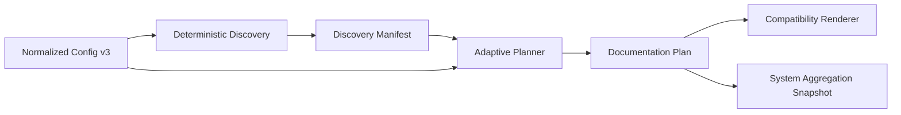

# Adaptive Planning Foundation

WikiForge 1.3 introduces an adaptive planning layer before the existing profile renderer. The renderer remains backward-compatible in Phase 1, while the deterministic artifacts define the future hierarchical domain, component, flow, catalog, platform, engineering, operations, and system views.

## Processing model



The discovery implementation is in [`/internal/discovery/discovery.go`](/internal/discovery/discovery.go). Planning is in [`/internal/planner/planner.go`](/internal/planner/planner.go). Orchestration persists and injects both artifacts from [`/internal/orchestrator/orchestrator.go`](/internal/orchestrator/orchestrator.go).

## Documentation units

A documentation unit is independent from the deployment boundary. Supported kinds are `domain`, `subdomain`, `bounded-context`, `component`, `module`, `flow`, `platform`, and `catalog`.

A configured unit preserves:

- component ownership;
- relative evidence roots;
- related units, including qualified cross-component references;
- future output path;
- owners and business capabilities;
- criticality;
- whether the unit was configured or discovered.

Discovery may infer nested domain/module roots and BPMN flows. Configured source-root coverage takes precedence and suppresses duplicate inferred units.

## Capability packs

The planner composes capability packs from three sources:

1. profile defaults;
2. explicit `components[].packs` configuration;
3. source evidence discovered inside the configured component scope.

Every registered pack receives an explicit `include`, `skip`, or `defer` decision. A disabled required view defers the pack with a reason. Output-path collisions are also deferred explicitly rather than silently dropping a page or unit.

## Evidence boundaries

Discovery applies `documentation.evidence.include`, `exclude`, and `maxFileSizeBytes`. It skips excluded directories, symbolic links, binary files, and oversized files. The source hash is based on sorted relative paths plus eligible file contents, with no timestamps or map-order-dependent fields.

## Persisted artifacts

```text
.wikiforge/
├── components/<component-id>/discovery.json
├── components/<component-id>/plan.json
└── system/plan.json
```

Whole-system aggregation copies component documentation together with `discovery.json` and `plan.json`, and writes `sources/system-plan.json`. Prompts and persistent `INSTRUCTIONS.md` files receive bounded summaries and point to the complete artifacts.

## Checkpoint invariant

Source, documentation, discovery, and plan hashes are last-successful checkpoints. A failed generation records failure status and phase evidence without replacing those hashes. This prevents a later update from treating an unsuccessful generation attempt as the current documented state.

## CLI

```text
wikiforge discover [--component ID]
wikiforge plan [--component ID] [--skip-system] [--explain]
wikiforge config migrate [--output wikiforge.v3.json] [--force]
```

`plan --explain` reports planned pages and all non-included decisions. Discovery or planning failures return a non-zero CLI exit code.

## Knowledge Gaps

Phase 1 does not replace the fixed profile renderer or structural validator. Hierarchical page materialization, collection sharding, semantic evidence indexing, and source-to-page change impact belong to later phases.

## Source References

- `/internal/config/config.go`
- `/internal/discovery/discovery.go`
- `/internal/planner/planner.go`
- `/internal/orchestrator/orchestrator.go`
- `/internal/prompts/prompts.go`
- `/schema/wikiforge-config.schema.json`
